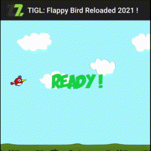

# TIGL

This project, **TIGL Demo**, give an overview of features offered by **TIGL** with **Titanium mobile application**. It also offer latest release of **TIGL module**.

**TIGL** module is intented to enable easy OpenGL rendering of 2d scenegraph from mobile applications. It offer a dedicated Titanium module to use it with [Titanium Appcelerator Application](https://github.com/m1ga/from_zero_to_app/blob/master/installation.md).

For now **Titanium TIGL module** only support Android devices (you are welcome to help us in porting it to IOS.)

**TIGL** is still in early development and not yet available as an open source project, note that opensourcing is planned once the project will be more mature.

## TIGL is made of three parts :

 - an Android scenegraph 2d library using OpenGL
 - a Titanium Java module *wich make the bridge between Titanium and the Android library*
 - a JavaScript module *wich offer an optimized and more convenient way  to controle the java module*

## Getting started

Prerequiste : [Titanium](https://www.appcelerator.com/) and [GIT](https://git-scm.com/) must be properly installed and running on your machine. To install Tianium you can refer to this [Tutorial](https://github.com/m1ga/from_zero_to_app/blob/master/installation.md).

1. First clone the repository:

		git clone https://github.com/DzzD/TIGLDemo

2. Build to Emulator or Device :

		titanium build --platform android -T [device|emulator]
	

## Using TIGL in your own project

1. First **install TIGL modules** in your own project :

	- Download latest TIGL zip release (fr.dzzd.tigl-android-X.X.X.zip(https://github.com/DzzD/TIGLDemo/releases/)) from this repository and paste the zip file into the root folder of your project (it will be automatically uncompressed and installed at first build of your project).
	

2. Enable TIGL module in **tiapp.xml**

		<modules>
			<module platform="android">fr.dzzd.tigl</module>
		</modules>

3. Modify a XML view to embed a TIGL view.

		<TIGLView id="glView" module="fr.dzzd.tigl" onInit="init" onLoop="loop"/>

4. Modify the view controller to load, move and interact with sprite.

		var  spriteUid;
		function  init()
		{
			this.addSprite({url: "Resources/sprite.png", x: 0, y: 50});
		}
		
		function  loop()
		{
			this.setEntityPositionById(spriteUid, 50 , 50);
		}
		
	Or with TIGLManager (highly recommended)
	
	
	
		const TIGLManager = require("tiglmanager");
		var tm;
		var  sprite;
		
		function  init()
		{
			tm = new TIGLManager(this);
			sprite=tm.addSprite({url: "Resources/sprite.png"});
		}
		
		function  loop()
		{
			sprite.x++;
			sprite.x %= 100;
		}
	

----------------------------------
DzzD and associated marks and logos are trademarks of SARL DzzD. 

TIGL is Copyright (c) 2020-2021 by DzzD. All Rights Reserved.

TIGL is licensed under the GNU general public License (Version 3+). Please
see the LICENSE file for the full license.

BMFont(https://www.angelcode.com/products/bmfont/) is licensed under ZLIB license.

Tweenjs(https://github.com/tweenjs/tween.js/) is licensed under MIT license.

